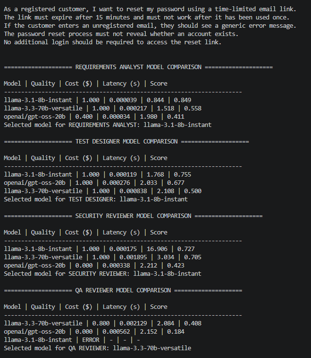
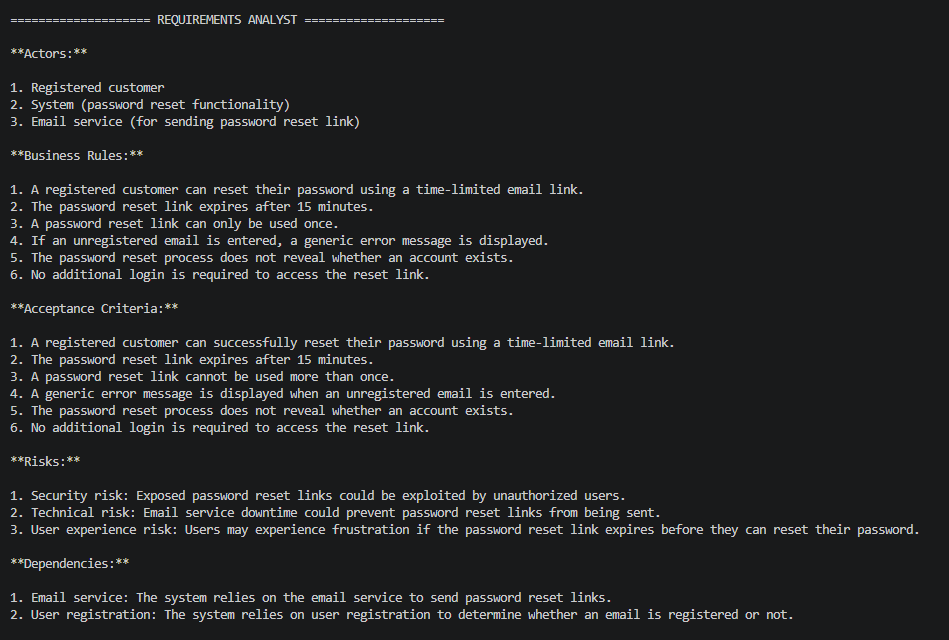
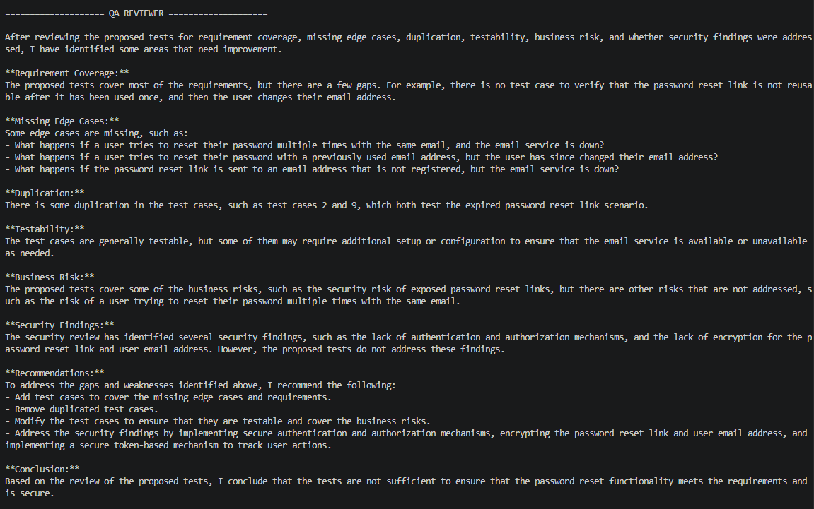

# Screenshots of response
## Comparative analysis

## 

## QA Reviewer



# Groq QA Exercise

This folder contains the Assignment 2 implementation for a multi-agent QA requirements workflow.

## What this exercise does

- Reads requirement text from `requirements_doc.md`.
- Runs a multi-agent QA workflow with four specialist agents:
  1. Requirements Analyst
  2. Test Designer
  3. Security Reviewer
  4. QA Reviewer
- Compares multiple Groq models for each agent using predefined metrics for:
  - quality
  - estimated cost
  - latency
- Selects the best model for each agent and prints the final QA output.

## Setup

1. Create and activate a Python 3.11/3.12 virtual environment.
2. Install dependencies:

```powershell
pip install -U langchain==1.3.14 langchain-groq==1.1.3 python-dotenv==1.2.2
```

3. Add your Groq API key to your environment or a `.env` file:

```powershell
setx GROQ_API_KEY "your-api-key"
```

Or create a `.env` file with this content:

```text
GROQ_API_KEY=your-api-key
```

## Run

```powershell
python run_groq_qa_exercise.py
```
