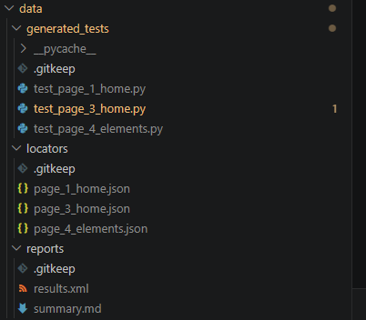
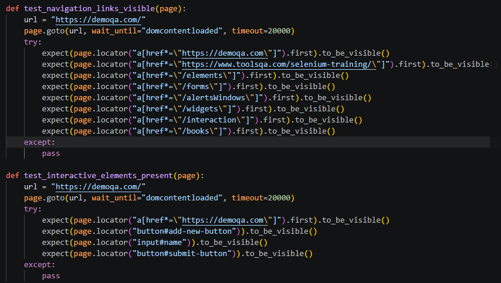
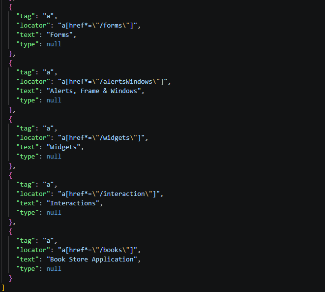
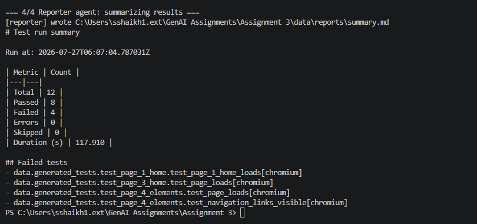
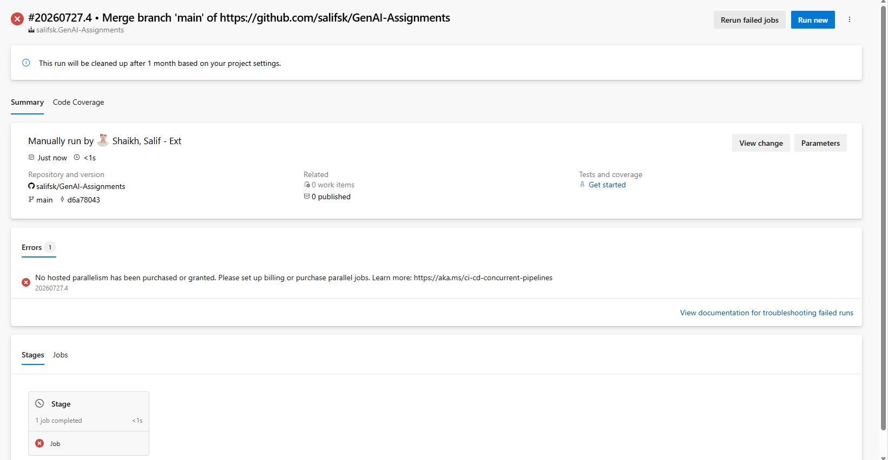

# Screenshot of the response
## Files automatically created after running the orchestrator


## Few generated locators



## Few generated test cases


## Report summary


## Azure Pipeline



# Multi-agent web test automation framework

Target under test: a configurable website, with SauceDemo used as the default example.
Stack: **Python, pytest, Playwright, Groq LLM, and a Playwright MCP-style adapter**.

## How it works

Four independent agents, coordinated by `orchestrator.py`, talk to each
other only through files in `data/` - not through shared code state. That
makes each agent replaceable and testable on its own.

1. **Scraper agent** (`agents/scraper_agent.py`) - opens the target site
   with Playwright, walks the login/inventory/cart pages, and saves every
   interactive element's most stable locator to `data/locators/*.json`.
2. **Generator agent** (`agents/generator_agent.py`) - sends each locator
   file to Groq's LLM API and asks it to write pytest + Playwright test
   functions, saved to `data/generated_tests/test_*.py`.
3. **Executor agent** (`agents/executor_agent.py`) - runs those generated
   tests with pytest, producing `data/reports/results.xml` (JUnit format).
4. **Reporter agent** (`agents/reporter_agent.py`) - parses the JUnit XML
   into a readable `data/reports/summary.md`.

`orchestrator.py` runs all four in sequence and is the single command used
both locally and in CI.

## Setup

```bash
python -m venv venv
source venv/bin/activate        # Windows: venv\Scripts\activate
pip install -r requirements.txt
playwright install --with-deps chromium

cp .env.example .env            # then edit .env and add your real GROQ_API_KEY
```

## Run locally

```bash
python orchestrator.py
```

Or run an individual agent while you're developing:

```bash
python -m agents.scraper_agent
python -m agents.generator_agent
python -m agents.executor_agent
python -m agents.reporter_agent
```

## Pushing to GitHub

```bash
git init
git add .
git commit -m "Multi-agent Playwright test framework"
git branch -M main
git remote add origin https://github.com/<your-username>/<your-repo>.git
git push -u origin main
```

`.env` is git-ignored on purpose - never commit your Groq key.

## Connecting Azure DevOps (important - read this)

**Two different PATs are easy to mix up:**

- A **GitHub PAT** authenticates `git push` to GitHub. You may or may not
  need this depending on how you've set up git credentials.
- An **Azure DevOps PAT** authenticates calls to Azure DevOps itself (its
  REST API, or the `az devops` CLI). This is almost certainly what your
  tutor gave you.

An Azure DevOps PAT alone isn't enough to create a pipeline - it needs an
**organization URL** to point at (e.g. `https://dev.azure.com/<org>`) and a
project inside it. You said you don't have that yet, so before going
further, ask your tutor for:
- the organization URL
- the project name
- confirmation of what the PAT is scoped to (it needs at least
  *Build (Read & execute)* and *Code (Read)* permissions)

Once you have those, there are two ways to create the pipeline:

**Option A - through the UI (simplest, recommended for an assignment):**
1. Sign in to `https://dev.azure.com/<org>` with the account tied to that org.
2. Open the project -> **Pipelines** -> **New pipeline**.
3. Choose **GitHub** as the source, authorize access, and select this repo.
4. Azure DevOps will detect `azure-pipelines.yml` at the repo root automatically.
5. Before running it, go to **Pipelines -> Edit -> Variables** and add:
   - `GROQ_API_KEY` - paste your Groq key, and tick **"Keep this value
     secret"**. This is what keeps it out of logs and out of git - it never
     goes in the YAML or in code.
   - `TARGET_URL` - `https://www.saucedemo.com/` (not secret).
6. Run the pipeline.

**Option B - scripted, using the PAT (if your tutor wants you to
demonstrate API-driven setup):** the Azure DevOps PAT is passed as a
bearer/basic-auth token to the Pipelines REST API to create the pipeline
definition programmatically. This is more advanced and only worth doing if
that's explicitly part of the assignment brief - Option A produces the
same running pipeline with far less risk of error.

Either way, **the PAT itself never belongs in your repository or in
`azure-pipelines.yml`.** It's only used interactively (UI login) or as an
environment variable in a script you run locally, never committed.

## Notes on the target site

saucedemo.com is designed for exactly this kind of automation practice, so
there's no ToS or bot-detection risk like there would be scraping a real
production site (e.g. Amazon) at any real volume. Login credentials used
by the scraper (`standard_user` / `secret_sauce`) are the site's own public
demo credentials, not real user data.
