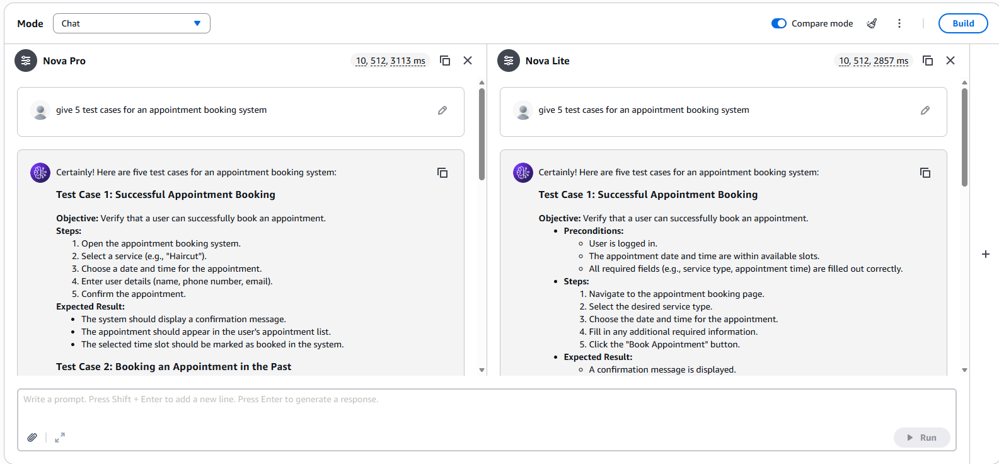
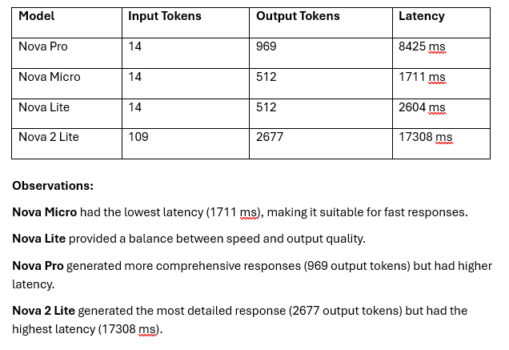
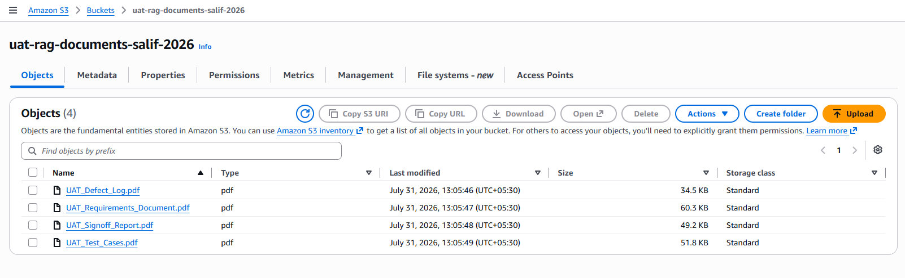
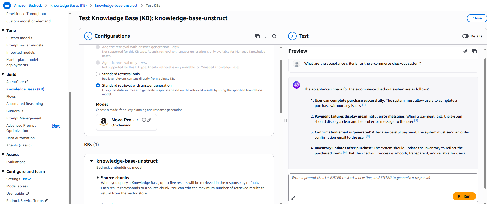
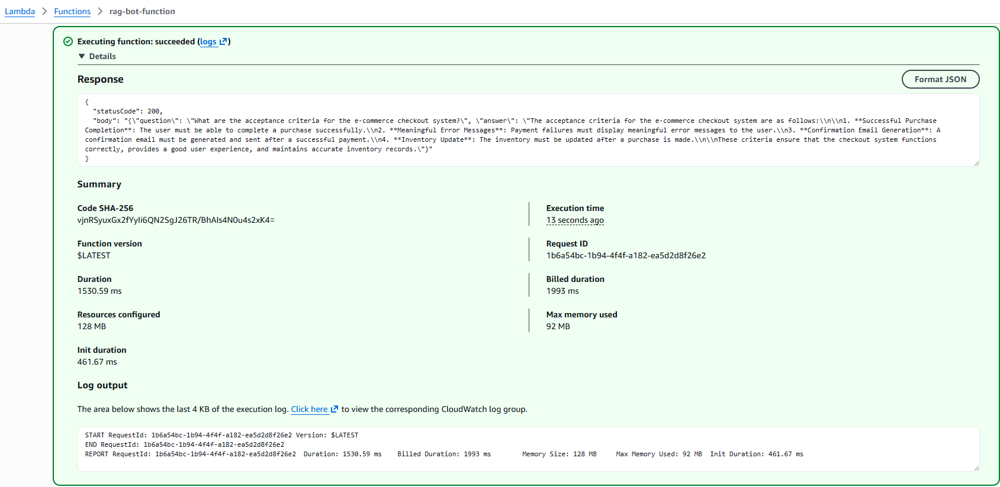
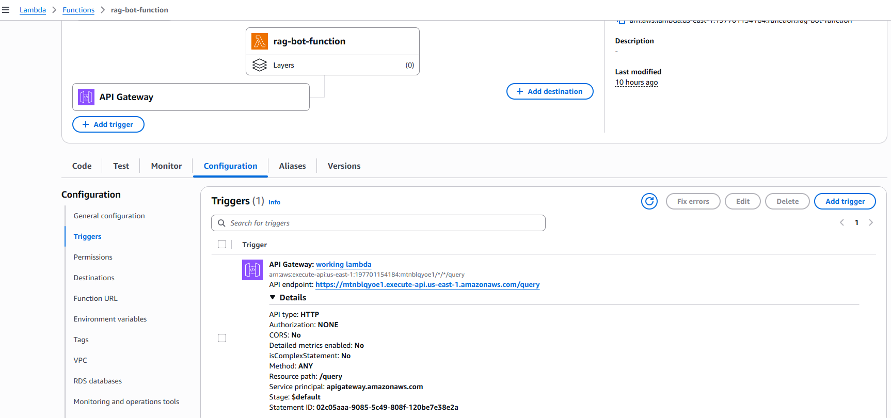
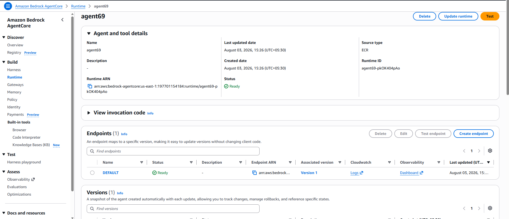
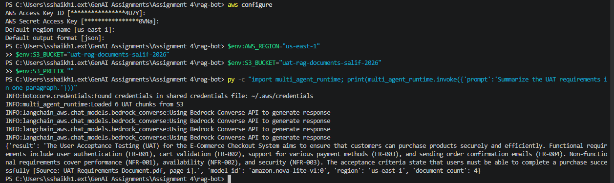

# Assignment 4 - RAG Bot for UAT Documents

This project implements a retrieval-augmented generation (RAG) assistant for User Acceptance Testing (UAT) documents. The bot uses AWS Bedrock AgentCore, LangChain, and PDF-based knowledge sources to answer questions about requirements, test coverage, defects, and release readiness.


# Screenshot of the response
## Model Comparison on Bedrock


## Comparison metrics



## S3 Bucket


## Knowledge Base - testing that knowledge base fetches the documents from S3 and gives appropriate response


## lambda function test - runs successfully with status code 200 and accurate response


## API Gateway - POST Request generation to invoke function


## Agentcore Creation


## Terminal output - agent fetches documents from S3 and gives accurate response in the terminal.


## What the project includes

- A multi-agent runtime for UAT analysis using specialized agents for retrieval, coverage review, and defect triage.
- A memory-enabled runtime that can retain conversation context across turns for the same user/session.
- Document loading logic that can read PDFs from a local folder or from S3.
- Supporting folders for evaluation, deployment, and sample UAT documents.

## Main components

- [rag-bot/multi_agent_runtime.py](rag-bot/multi_agent_runtime.py): Main multi-agent RAG workflow.
- [rag-bot/agentcore_memory_runtime.py](rag-bot/agentcore_memory_runtime.py): Memory-enabled variant for persistent conversations.
- [rag-bot/document_sources.py](rag-bot/document_sources.py): Resolves document locations from local storage or S3.
- [rag-bot/uat_documents](rag-bot/uat_documents): Folder for the PDF documents used as the knowledge base.

## Features

- Searches UAT PDFs for evidence-based answers
- Cites source documents and page numbers in responses
- Supports S3-backed documents as well as local PDF files
- Uses specialized agents to separate retrieval, coverage analysis, and defect triage
- Can optionally retain memory across sessions

## Prerequisites

- Python 3.10 or later
- AWS access with permissions for Bedrock and Bedrock AgentCore
- A working AWS CLI configuration or environment credentials

## Setup

1. Open the project folder:
   ```bash
   cd "Assignment 4/rag-bot"
   ```
2. Create and activate a virtual environment:
   ```bash
   python -m venv .venv
   .venv\Scripts\activate
   ```
3. Install the required packages:
   ```bash
   pip install -r requirements.txt
   ```

## Configuration

Set the following environment variables before running the app:

- `AWS_REGION` - AWS region for Bedrock access
- `MODEL_ID` - Bedrock model ID (defaults to `amazon.nova-lite-v1:0`)
- `UAT_DOCUMENT_DIRECTORY` - Folder containing the UAT PDFs
- `S3_BUCKET` and `S3_PREFIX` - Optional values if documents are stored in S3

## Running the application

The main runtime can be started with:

```bash
python multi_agent_runtime.py
```

The runtime expects an input payload similar to:

```json
{
  "prompt": "What acceptance criteria are covered in the UAT documents?"
}
```

## Notes

- The assistant is designed to answer only from the provided document corpus and should cite evidence where possible.
- If no PDF documents are found in the configured location, the runtime will return an error.
- The project also includes evaluation and deployment assets for further experimentation and integration.
